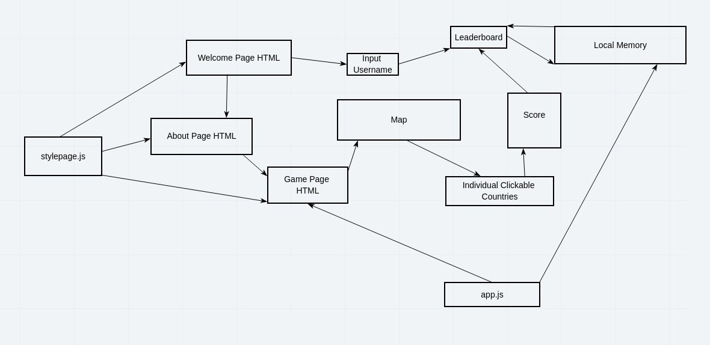

# globetrotters
An educational game where a user can learn geografical locations of European countries.

## Wireframes

## User Stories

1. As a traveler, I want to learn where the countries in Europe located, so that I can make travel plans.

2. As a user, I want to be tested on my knowledge of European geography visually and in a game like format.

3. As a learner, I want to find a country on a blank map when I am asked where it is, so that it helps me rememeber its location.

4. As a user, I want it to keep score, so that I can improve my score next time.

5. As a user, I want several limited attempts on each country and get hints if I miss the first time.

6. As a user, I want the country to light up in different colors when I hover over it, so that I know what I am clincking on.

7. As a user, I want the country to turn into a different color when I get it right or I run out of attempts and make the country name visible.

## Domain Modeling

Upon load the user will be taken to the "Welcome" page. Within the welcome there were be links to the "Game" and "About".

Once the user has clicked on "Game" the game will display a map, with the map linked to a different element for each possible country.

app.js will be linked to the "Game" page, and also be able to link to local memory.

The individual countries will link to an object which holds the scores, which will in turn be linked to the leader board.

The leader board is connected to local memory and will be associated with username that the user will input on the welcome page.

From either "Game" or "Welcome" the user can click a link to the "About" page, which holds information on all developers who worked on the project.

All pages will be linked to a central style page, with potential individual style pages for each individual page as necessary.

## Databases

The web-stie is not using databases. The user's name and the score will be stored in a local storage.
